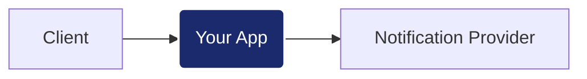

# Python Backend Challenge: Notification Service

## El Reto
Implementar un servicio de notificaciones que actúe como mediador entre los clientes y un proveedor externo. Tu objetivo es diseñar una solución que pase satisfactoriamente la suite de validación de rendimiento y resiliencia.

## Contrato de API
Para que la suite de tests (`k6`) pueda validar tu solución, debes implementar estrictamente los siguientes endpoints:

### Consideraciones Técnicas
Para que el contenedor `app` de Docker pueda arrancar tu solución, debes respetar la siguiente estructura base:
- **Punto de Entrada:** El archivo principal debe ser `app/main.py`.
- **Instancia de API:** Debes definir una instancia de FastAPI llamada `app` (ej: `app = FastAPI()`).
- **Puerto:** La aplicación debe correr internamente en el puerto `5000`.

### 1. Registro de Solicitud
- **Ruta:** `POST /v1/requests`
- **Cuerpo (JSON):** `{"to": "string", "message": "string", "type": "email|sms|push"}`
- **Respuesta:** `201 Created` con JSON `{"id": "string"}`.

### 2. Procesamiento de Envío
- **Ruta:** `POST /v1/requests/{id}/process`
- **Descripción:** Lanza la integración con el proveedor externo. 
- **Respuesta:** `200 OK` o `202 Accepted`.

### 3. Consulta de Estado
- **Ruta:** `GET /v1/requests/{id}`
- **Respuesta:** `200 OK` con JSON `{"id": "string", "status": "queued|processing|sent|failed"}`.

## Integración Externa (Provider)
Tu servicio debe consumir el proveedor externo ya incluido en la infraestructura:
- **Endpoint:** `POST http://provider:3001/v1/notify`
- **Seguridad:** Requiere el header `X-API-Key: test-dev-2026`.
- **Documentación del Provider:** Una vez levantado el entorno, puedes consultar su API Docs en `http://localhost:3001/docs`.

## Infraestructura y Evaluación
El entorno utiliza Docker Compose e incluye herramientas de observación:
1. **Preparar infraestructura:** `docker-compose up -d provider influxdb grafana`
2. **Levantar tu aplicación:** `docker-compose up -d --build app`
3. **Ejecutar validación:** `docker-compose run --rm load-test`
4. **Scorecard de Ingeniería:** Los resultados se visualizan en tiempo real en Grafana: [http://localhost:3000/d/backend-performance-scorecard/](http://localhost:3000/d/backend-performance-scorecard/)

---
*Nota: Se evaluará la arquitectura de la solución, su capacidad de respuesta bajo carga y la gestión de la resiliencia ante errores del proveedor.*
